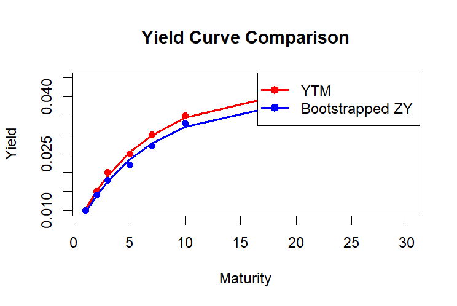

# Yield Curve Construction Using Nelson-Siegel Model

## Overview
This project involves constructing and comparing yield curves using two different types of inputs: Yield to Maturity (YTM) and Bootstrapped Zero Yields (ZY), employing the Nelson-Siegel model. The comparison aims to illustrate the implications of using each input type on the shape and the interpretation of the resulting yield curve.

## Inputs
The project uses the following inputs for yield curve construction:
- **Yield to Maturity (YTM)**: These are the total returns anticipated on bonds if they are held until maturity, considering all coupon payments and reinvestment at the same rate.
- **Bootstrapped Zero Yields (ZY)**: These are yields derived from the prices of a set of bonds through the bootstrapping process, representing the yield of zero-coupon bonds across different maturities.

## Nelson-Siegel Model
The Nelson-Siegel model is a parametric model that captures the term structure of interest rates using three factors:
- Level (\(eta_0\)): Long-term rates
- Slope (\(eta_1\)): Short-term rates
- Curvature (\(eta_2\)): The rate of transition between short-term and long-term rates

## Implementation
The implementation involves fitting the Nelson-Siegel model parameters to the YTM and ZY data using non-linear least squares estimation. The model is defined by the following formula:

\[ R(t) = eta_0 + eta_1 rac{1 - e^{-t/	au}}{t/	au} + eta_2 \left( rac{1 - e^{-t/	au}}{t/	au} - e^{-t/	au} 
ight) \]

where \( R(t) \) is the interest rate at time \( t \).

## Results
The project outputs two yield curves, one for each input type, plotted over a range of maturities. The differences between the curves highlight the impact of using YTM versus ZY inputs in the construction and analysis of yield curves.
Below is the plot comparing the Yield to Maturity (YTM) based curve with the Bootstrapped Zero Yields (ZY) based curve:

## Conclusion
The choice between YTM and ZY inputs has significant implications for the analysis of interest rates and the valuation of financial instruments. The appropriate choice depends on the intended use of the yield curve, whether for understanding market pricing, risk management, or derivative pricing.

For further details on the methodology and the results, refer to the source code and the generated plots within this project.
